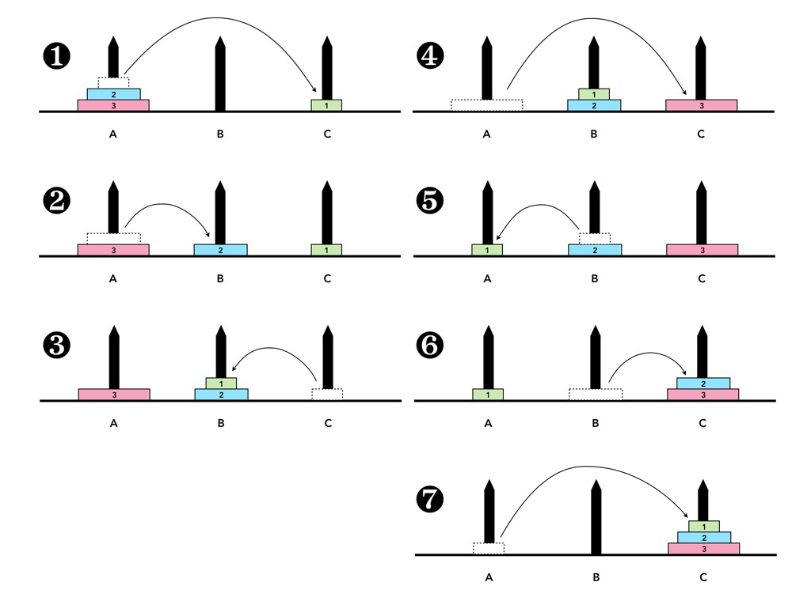

# Tower_of_Hanoi

This is a simple C++ Script to solve the Tower of Hanoi Problem

The problem is showcased in the image below:

  

#### The rules for the program are:

- Only one disk can be moved at a time.
- Each move consists of taking the upper disk from one of the stacks and placing it on top of another stack i.e. a disk can only be moved if it is the uppermost disk on a stack.
- No disk may be placed on top of a smaller disk.

